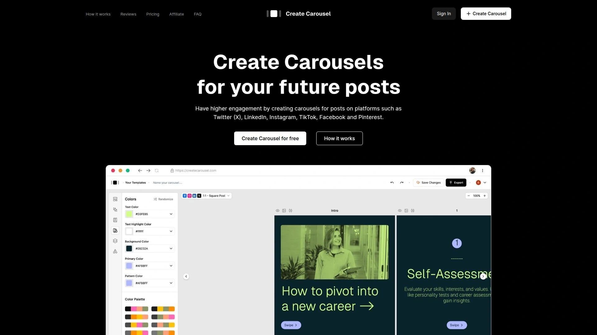
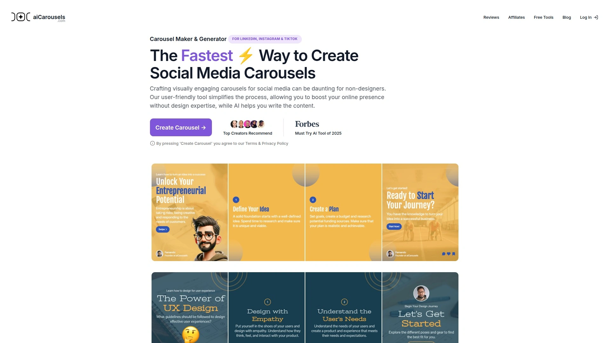
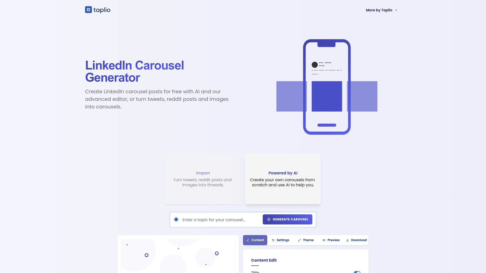
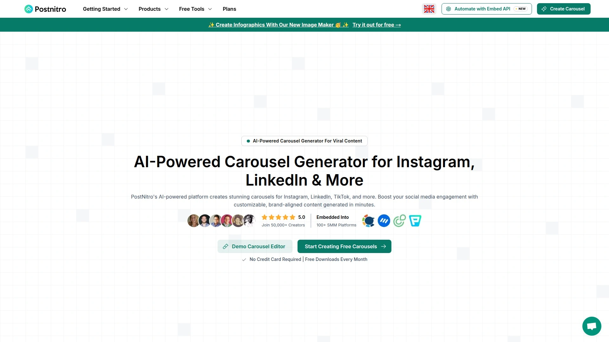
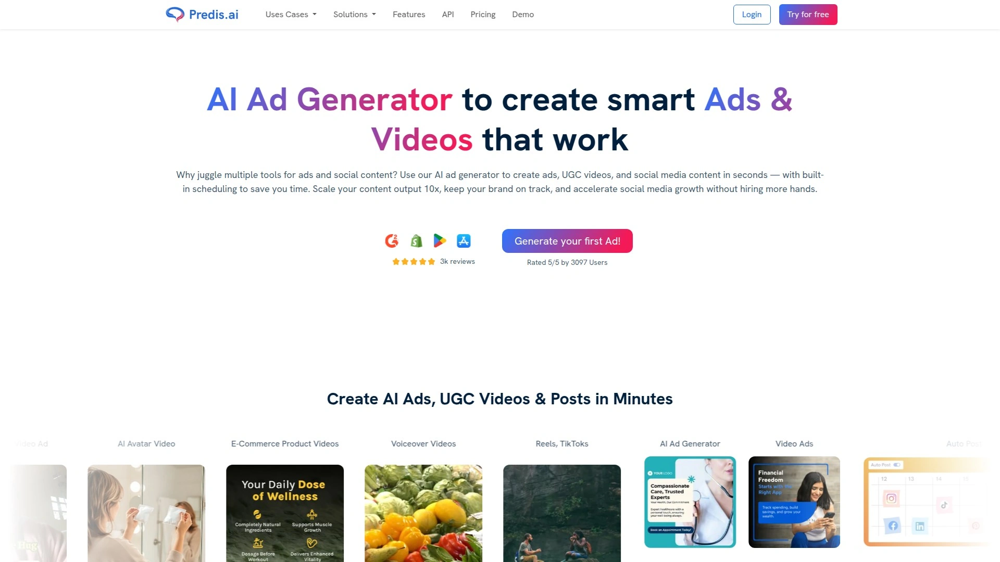
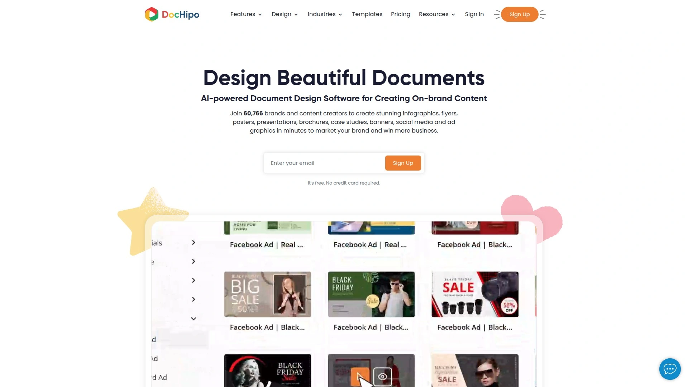
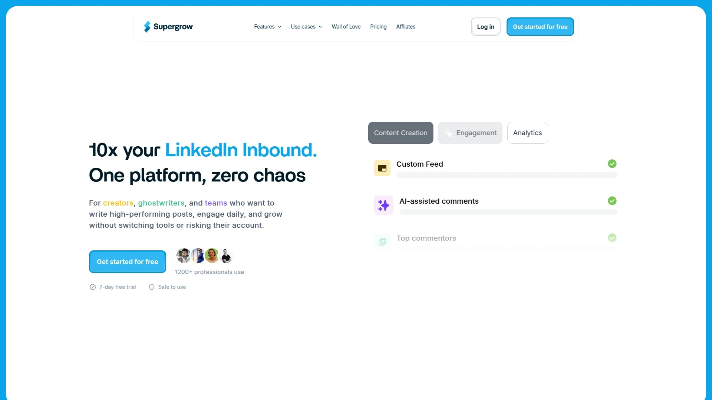
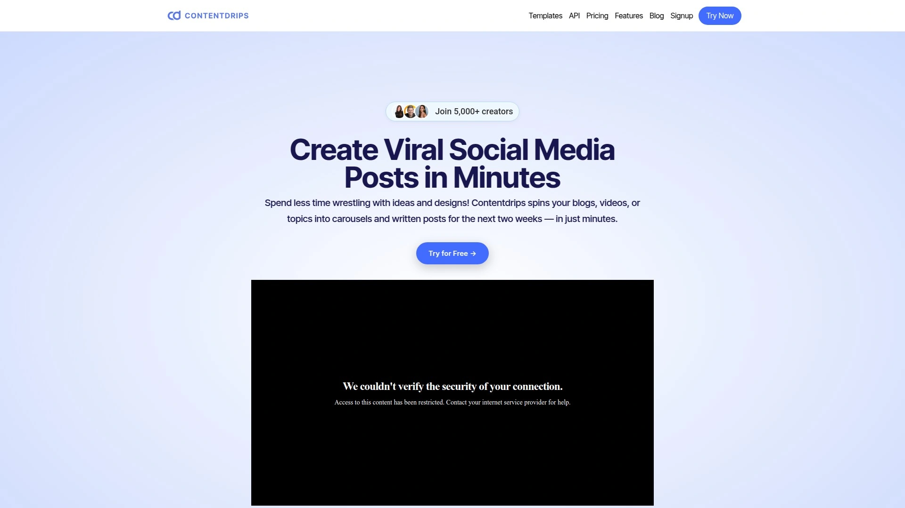
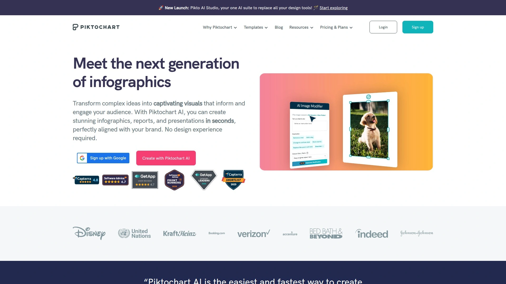

# Latest LinkedIn Carousel Maker Complete List (Including Design Features)

Posting static images on LinkedIn isn't cutting it anymore. Your audience scrolls past single posts in seconds, but carousels stop the scroll and demand attention. Creating multi-slide content that flows smoothly takes either design skills you don't have or hours you can't spare. LinkedIn carousel makers solve this by turning your ideas into polished, swipeable posts in minutes rather than days.

***

## **[CreateCarousel](https://www.createcarousel.com)**

Free multi-platform carousel creation with AI content generation.

CreateCarousel handles carousel design for LinkedIn, Instagram, Twitter, TikTok, Facebook, and Pinterest from a single interface. The platform stands out by offering genuinely free access without forcing you into paid plans to unlock basic functionality. You get 25+ professionally designed templates covering business, marketing, education, and personal branding topics.

The AI-powered content generator creates complete carousel scripts based on your topic input. Select your tone of voice and preferred language, then the system drafts text for every slide that you can edit and refine. This speeds up the ideation phase dramatically—instead of staring at blank slides wondering what to write, you start with structured content that just needs personalization.

Carousels created on the platform leverage algorithmic advantages built into social platforms. When someone sees your carousel but doesn't swipe, the algorithm shows them a different slide from the same post to test whether another angle captures interest. This gives your content multiple chances to engage the same viewer, increasing overall impression counts without creating separate posts.

The drag-and-drop editor lets you customize colors, fonts, images, and layouts to match your brand identity. Export options include PDF format for LinkedIn uploads or individual image files for other platforms. The multi-platform approach means creating once and adapting for different channels rather than starting from scratch for each network.

**Best for solopreneurs, marketers, and content creators who need cross-platform carousel design without subscription costs, plus AI assistance to overcome writer's block.**

***

## **[aiCarousels](https://www.aicarousels.com)**

Lightning-fast carousel generation with zero signup required.

aiCarousels delivers on its promise of being the fastest carousel creation tool by eliminating every friction point. No account creation, no email verification, no payment method—just open the site and start designing. This makes it perfect for quick content needs or testing carousel ideas without commitment.

The AI carousel generator transforms topics into complete carousel posts within seconds. Enter your subject, specify slide count, and the system generates content, selects appropriate templates, and structures the flow. For LinkedIn creators specifically, this tool earned praise from influencers who noted it reduces creation time from 6 hours to 6 minutes.

Template variety covers educational content, promotional posts, listicles, how-to guides, and thought leadership pieces. Each template uses proven layouts optimized for engagement based on thousands of successful carousel posts. The color palette selector helps maintain visual consistency across all slides without manually adjusting each element.

You can upload custom templates if you have existing brand guidelines, making it easy to maintain consistency while leveraging the speed of AI generation. The tool supports LinkedIn, Instagram, and TikTok carousel formats with automatic sizing for each platform. Downloads come as PDFs or individual images depending on your posting workflow.

**Ideal for creators who value speed above all else, anyone testing carousel content before committing to paid tools, and marketers creating high volumes of carousel posts weekly.**

***

## **[Taplio](https://taplio.com/carousel)**

Advanced LinkedIn carousel generator with Twitter thread conversion.

Taplio specializes in LinkedIn content creation with carousel generation as a core feature within a broader personal branding toolkit. The platform converts existing Twitter threads, Reddit posts, and images into LinkedIn carousel format, repurposing content you've already created rather than starting from scratch.

The conversion process maintains the narrative structure from original threads while reformatting for LinkedIn's visual carousel style. Simply paste URLs from Twitter threads or Reddit discussions, select your preferred theme, and Taplio transforms the text into designed slides. This repurposing approach maximizes value from content that performed well on other platforms.

AI content generation creates carousel posts from topics when you don't have existing material to convert. Enter your subject area, and the system generates relevant slides with cohesive messaging. Advanced customization options include adding your LinkedIn profile picture, customizing handles, selecting from multiple visual themes, and adjusting engagement elements.

The platform emphasizes data-backed creation, noting that 77% of technical audiences on LinkedIn prefer carousels over other content formats. Built-in analytics help track which carousel topics and styles drive the most engagement, informing future content strategy. Taplio functions as part of a complete LinkedIn toolkit including post scheduling, engagement tracking, and lead generation features.

**Perfect for LinkedIn-focused creators, professionals repurposing Twitter content, and users who want carousel creation integrated with broader LinkedIn growth tools.**

***

## **[Canva](https://www.canva.com)**

Full-featured design platform with extensive carousel templates and brand kits.

Canva dominates visual content creation across formats, and carousel design benefits from the platform's mature feature set. The template library includes hundreds of LinkedIn carousel designs covering every industry and content type. Professional designers create these templates, ensuring visual quality that reflects well on your personal brand.

Brand Kit functionality centralizes your logos, color palettes, fonts, and visual assets in one place. When you create carousels, Canva automatically applies your brand guidelines to maintain consistency across all content. This eliminates the tedious process of manually matching colors and fonts for every new carousel project.

The drag-and-drop interface includes animations, transitions, visual effects, and layering capabilities that simpler carousel tools lack. You can add custom graphics, upload your own photography, access millions of stock images, and incorporate video elements for platforms that support mixed media carousels. Collaboration features let teams work together on carousel projects with commenting and approval workflows.

LinkedIn carousel size presets (1080 x 1350 px or 1200 x 1500 px) ensure proper formatting without manual dimension adjustments. Canva's ecosystem extends beyond carousels to presentations, social posts, documents, and videos, making it a comprehensive design solution. The free plan provides significant functionality, while Canva Pro unlocks advanced features for $12.99/month.

**Best for teams requiring collaboration, users needing comprehensive design tools beyond carousels, brands prioritizing visual polish, and creators comfortable investing in professional design software.**

***

## **[PostNitro](https://postnitro.ai)**

AI-powered carousel creation with built-in image maker for custom graphics.

PostNitro combines AI content generation with a custom image maker, addressing both the copywriting and visual design challenges of carousel creation. The newly launched Image Maker lets you design custom infographics, charts, and visual elements directly within the platform rather than sourcing graphics externally.

The AI analyzes your topic or imported content (blog posts, videos, articles) and generates carousel slides optimized for engagement. Enter text, paste a URL, or upload a document, and PostNitro extracts key insights while structuring them into a logical slide sequence. This content intelligence saves hours compared to manually outlining and designing each slide.

Over 50,000 creators use PostNitro for LinkedIn, Instagram, and TikTok carousel design. The platform provides curated font pairings and color schemes that work together aesthetically, removing guesswork from design decisions. Templates are organized by industry and content type, helping you quickly find relevant starting points for your specific needs.

Customization options include uploading brand assets, adjusting layouts, modifying text, swapping images, and fine-tuning colors. The editor balances ease of use with flexibility—simple enough for non-designers but powerful enough for detailed customization. Integration with major social media management platforms lets you schedule carousel posts directly after creation.

**Suited for content creators repurposing long-form content, marketers managing multiple social accounts, and users who want AI assistance with both writing and visual design.**

---

## **[Predis.ai](https://predis.ai)**

Multi-platform carousel automation with caption and hashtag generation.

Predis.ai approaches carousel creation as part of complete social media post automation, generating not just the carousel slides but also optimized captions and hashtags. This holistic approach addresses the full content creation workflow from ideation through publishing.

The AI understands your business context, target audience, and content goals to produce on-brand carousels. Specify whether you want educational, promotional, or engagement-focused content, then provide a brief description of your idea. Predis analyzes the input and generates post ideas, selects appropriate templates, writes copy, and creates cohesive visual design.

Multi-language support creates carousels in over 18 languages, making it valuable for international brands or creators targeting non-English audiences. Bulk creation capabilities let you generate an entire month's content calendar in minutes, dramatically scaling content production. The tool works across Instagram, Facebook, LinkedIn, Pinterest, Twitter, and TikTok.

Brand consistency features ensure all generated carousels use your logos, colors, gradients, and preferred visual styles automatically. Direct publishing and scheduling integration means you can create and schedule carousel posts without leaving the platform. The built-in stock image library provides millions of royalty-free images searchable by keyword.

**Perfect for agencies managing multiple clients, brands needing multilingual content, and marketers focused on scaling content production without expanding team size.**

***

## **[DocHipo](https://www.dochipo.com)**

Business-focused carousel maker with professional templates and team collaboration.

DocHipo caters specifically to business professionals, brands, and content creators who need polished LinkedIn carousels without design expertise. The template library organizes designs by business category including marketing, sales, finance, HR, and entrepreneurship, making it easy to find industry-appropriate starting points.

Professional layouts and graphics come pre-designed, eliminating the challenge of creating visual flow from scratch. The widget library includes hundreds of icons, stickers, stock images, and illustrations that you can search and add to carousel slides. Custom font upload supports brand consistency when you have specific typography requirements.

Text customization tools include size, font, color, bold, italic, and underline formatting accessible from the editing toolbar. Background options span solid colors, gradients, patterns, and images. The Themes feature changes the entire carousel color scheme with one click, helpful for quickly testing different visual styles.

Team collaboration features let multiple users work on carousel projects simultaneously with role-based permissions. Brand kit functionality centralizes logos, colors, and assets for consistent application across all team content. The platform supports exporting carousels as PDFs for LinkedIn upload or individual images for other social networks.

**Ideal for business professionals, corporate marketing teams, B2B brands, and users who prioritize professional aesthetics in LinkedIn content.**

***

## **[Supergrow](https://supergrow.ai)**

Complete LinkedIn growth platform with integrated carousel maker and publishing.

Supergrow combines carousel creation with LinkedIn personal branding tools including post scheduling, analytics, and engagement tracking. This integrated approach means designing carousels within the same platform where you manage your entire LinkedIn content strategy.

The carousel generator converts ideas into clean, visually appealing slides quickly. Ready-made templates with brand kit support maintain visual consistency while accelerating creation. Direct publishing from the editor to LinkedIn eliminates the export-upload workflow, streamlining the entire process from creation to posting.

AI-driven content suggestions tailor carousel topics and messaging to your specific audience and communication style. The system learns from your previous content and engagement patterns to recommend topics likely to resonate. This personalization helps maintain authentic voice while benefiting from AI efficiency.

Analytics integration shows how carousel posts perform compared to other content formats, helping optimize your LinkedIn strategy over time. The platform tracks engagement rates, reach, impressions, and audience growth metrics tied to specific carousel posts. Template customization includes text editing, color scheme adjustments, and asset uploads.

**Best for LinkedIn creators focused on personal branding, professionals managing entire LinkedIn presence from one platform, and users who want creation and publishing unified.**

***

## **[ContentDrips](https://contentdrips.com)**

Content repurposing specialist turning blogs and videos into LinkedIn carousels.

ContentDrips excels at transforming long-form content like blog posts, YouTube videos, and articles into social media carousel format. This repurposing approach maximizes content value by adapting existing material for different platforms and audiences rather than creating from scratch every time.

The AI analyzes your source content, extracts key points, and restructures them into carousel-appropriate messaging. Upload a blog URL or paste article text, and ContentDrips generates a complete carousel maintaining the original insights while adapting tone and structure for social consumption. This works especially well for companies with content libraries that aren't getting social media exposure.

Multiple output format support extends beyond carousels to single posts, video clips, and quote graphics. Workflow automation lets you batch-process multiple pieces of content simultaneously. The platform supports LinkedIn, Instagram, Facebook, and Twitter, adjusting formatting and messaging appropriately for each network's audience expectations.

The repurposing focus makes ContentDrips particularly valuable for companies with existing content strategies looking to amplify reach without creating net-new material. Agencies managing multiple client content calendars benefit from the efficiency of adapting proven content rather than ideating fresh concepts for every post.

**Suited for content marketers with extensive blog libraries, agencies managing multiple clients, and businesses focused on content amplification rather than creation.**

***

## **[VDraw](https://vdraw.ai)**

Transform any content into carousels in 30 seconds with AI extraction.

VDraw positions itself as the fastest content-to-carousel converter, processing text, topics, YouTube links, or PDF uploads into finished carousel posts within 30 seconds. The speed claim targets creators drowning in content creation demands who need to maintain posting frequency without sacrificing quality.

The AI extracts key insights from source material automatically, eliminating the manual work of identifying main points and restructuring them for visual presentation. Paste a YouTube link, and VDraw generates carousel slides highlighting the video's core messages. Upload a PDF report, and it creates carousel posts summarizing findings.

Multi-language support and customizable slide count give you control over output without slowing down the process. The one-click variation feature generates alternative design versions of the same content, useful for A/B testing or refreshing older carousel posts. Platform optimization adjusts formatting for LinkedIn, Instagram, and TikTok automatically.

The tool reports 20x productivity improvements for content creators by removing design complexity and manual content structuring. Over 2 million users globally and 50,000+ daily carousel creations demonstrate adoption among time-pressed marketers. The free tier provides access without payment details, while paid plans unlock higher volume and premium features.

**Perfect for high-volume content creators, repurposing specialists, marketers prioritizing speed, and users converting YouTube or PDF content into social posts.**

***

## **[Piktochart](https://piktochart.com)**

Visual storytelling platform with AI carousel maker and data visualization.

Piktochart brings data visualization expertise to carousel creation, making it particularly strong for carousels incorporating charts, graphs, and statistical information. The AI carousel maker generates visual stories from your concepts while maintaining design quality that reflects professionally on brands and businesses.

Template selection spans business presentations, educational content, marketing campaigns, and data-driven storytelling. The platform excels when your carousel needs to convey complex information visually rather than relying solely on text and generic images. Integration with data sources lets you create dynamic visualizations that update automatically.

Customization tools include drag-and-drop editing, color scheme selection, font pairing, icon libraries, and illustration sets. The editor balances simplicity for beginners with depth for users wanting detailed control. Export options support LinkedIn, Instagram, and presentation formats.

The simple interface and robust features make Piktochart accessible to non-designers while providing capabilities professionals expect. Organizations using the platform include businesses, brands, and professionals focused on clear communication of data and concepts. Pricing tiers accommodate individual creators through enterprise teams.

**Ideal for data-driven content, business professionals presenting statistics, educators creating instructional carousels, and brands prioritizing information clarity over decorative design.**

***

## **[Adobe Express](https://express.adobe.com)**

Professional-grade carousel design with Adobe Creative Cloud integration.

Adobe Express delivers creative professional tools in an accessible format optimized for social media carousel creation. The platform bridges the gap between consumer-friendly carousel makers and full Adobe Creative Suite complexity, offering more power than basic tools without requiring professional design training.

Integration with the Adobe ecosystem means seamlessly importing assets from Photoshop, Illustrator, or Lightroom directly into carousel projects. Edit Photoshop files within Adobe Express via Photoshop on the web, maintaining quality and flexibility throughout the creative process. This workflow appeals to users already invested in Adobe tools.

Template quality reflects Adobe's design heritage with sophisticated layouts, typography, and visual effects. Animation capabilities add motion to carousel slides, creating engaging content that stands out in feeds. Generative AI features create custom visual assets on demand, providing unique imagery without stock photo libraries.

The learning curve exceeds simpler carousel tools, but tutorials and community resources help new users get productive quickly. Pricing integrates with Adobe Creative Cloud subscriptions, making it cost-effective for users already paying for Adobe products but potentially expensive for carousel-only needs.

**Best for creative professionals, brands with existing Adobe workflows, users needing advanced animation and effects, and creators prioritizing sophisticated design over simplicity.**

***

## FAQ

**Do carousel maker tools work for platforms beyond LinkedIn?**

Most modern carousel makers support multiple platforms including LinkedIn, Instagram, Twitter, TikTok, and Facebook. Tools like CreateCarousel, Predis.ai, and VDraw automatically adjust dimensions and formatting for different networks. LinkedIn carousels require PDF upload (created from images), while Instagram uses native multi-image posts. Check each tool's export options to confirm it supports your target platforms. Some tools specialize in LinkedIn while others prioritize Instagram or offer equal multi-platform support.

**Can AI-generated carousel content sound authentic to my brand voice?**

AI carousel generators like PostNitro and aiCarousels let you specify tone, style, and language preferences to match your brand voice. The AI provides starting content that you edit and personalize rather than publishing verbatim. Most successful creators use AI for structure and first drafts, then inject personality during editing. Tools that learn from your previous content (like Supergrow) adapt better to your specific voice over time. The key is treating AI output as a time-saving foundation rather than finished copy.

**What's the ideal number of slides for LinkedIn carousel posts?**

LinkedIn supports up to 10 carousel slides (created from a PDF with 10 pages/images). Engagement data shows 5-8 slides typically perform best—long enough to provide value but short enough that viewers complete the swipe sequence. Educational content works well with 6-7 slides for step-by-step explanations. Listicles engage with 5 slides highlighting key points. Story-driven carousels maintain interest through 8-10 slides. Test different lengths and monitor completion rates to find what resonates with your specific audience.

***

## Conclusion

The carousel maker tools above each bring different strengths depending on whether you prioritize speed, design quality, AI assistance, or multi-platform publishing. Testing a few free options helps identify which workflow fits your content creation style and volume needs. [CreateCarousel](https://www.createcarousel.com) stands out for creators and marketers wanting genuinely free carousel creation across LinkedIn, Instagram, Twitter, TikTok, Facebook, and Pinterest without feature restrictions. The combination of 25+ templates, AI content generation, and multi-platform support makes it particularly valuable for solopreneurs and small teams producing regular carousel content without budget for paid subscriptions.
